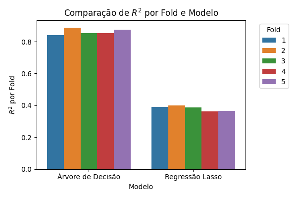
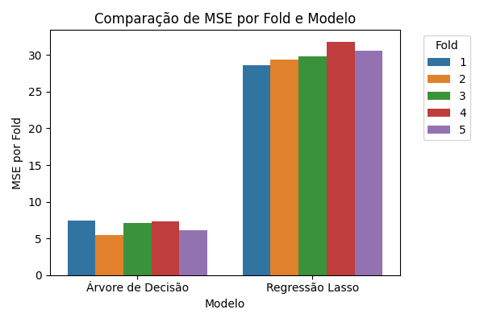

# Socioeconomic Determinants of Suicide Rates - ML Analysis

[](https://www.python.org/)
[](https://scikit-learn.org/)
[](https://github.com/psf/black)

Machine learning analysis to identify the top 5 socioeconomic determinants of suicide rates using World Bank (WDI) and WHO data. Systematic reduction from 1509 → 5 interpretable variables focused on mental health public policy.

📄 **[Read the full paper](article/article.pdf)** | 📊 **[View results](results/)**

## 🎯 Main Results

**Decision Tree** (best model): R² = 0.82, MSE = 8.56  
**Lasso Regression**: R² = 0.24, MSE = 36.82

### Top 5 Identified Determinants

| Variable | Importance | Effect | Interpretation |
|----------|------------|--------|----------------|
| 🚺 **Female labor force participation** | 0.296 | ⬆️ | "Double burden" stress |
| 🏙️ **Population density** | 0.284 | ⬇️ | Access to services/social networks |
| 🏭 **Industrial employment** | 0.169 | ⬆️ | Adverse working conditions |
| ⚡ **Access to electricity** | 0.137 | ⬇️ | Development indicator |
| 🏥 **Private health spending** | 0.115 | ⬇️ | Access to mental health |

 

## 📊 About the Project

Analysis of **185 countries (2000-2021)** integrating **World Bank** and **WHO** data to identify socioeconomic factors that most influence suicide rates. Complete pipeline: data collection → variable selection → modeling → interpretation.

**Why this matters?** Suicide affects 720+ thousand people/year (WHO). Identifying actionable determinants helps develop effective public policies (aligned with UN SDGs).

### Methodology Summary
1. **Data**: 1509 WDI variables + age-standardized suicide rates (WHO)
2. **Selection**: Correlation filters + Maximum Independent Set → 74 variables
3. **Modeling**: Decision Trees + Lasso Regression (5-fold CV)
4. **Interpretation**: Importance analysis + direction of associations

## � Quick Start

```bash
# Install requirements
pip install -r requirements.txt

# Run best model (Decision Tree with 5 key variables)
python scripts/modeling/generic_regression_crossval.py --model decision_tree --mode interpretable

# Generate comparison plots
python scripts/plot_comparacao_modelos.py
```

## 📁 Structure

```
├── data/
│   ├── raw/          # Original API data
│   ├── interim/      # Intermediate processing  
│   └── processed/    # Final datasets
├── scripts/
│   ├── data_processing/  # Extraction and processing
│   └── modeling/         # ML models
├── results/          # Model outputs
└── src/             # Utilities and feature selection
```

## 🔧 Requirements

```bash
pip install -r requirements.txt
```

**Main dependencies**: Python 3.8+, scikit-learn, pandas, numpy, matplotlib, seaborn, requests

## 🎯 Contributions

- Systematic reduction 1509→5 interpretable variables
- Directionality analysis (decision trees)
- Reproducible pipeline for epidemiological studies
- Actionable insights for suicide prevention

## ⚠️ Limitations

- Aggregated data (ecological fallacy)
- Imputation required for all observations  
- Directionality analysis could be improved (SHAP/LIME)

## 👥 Authors

**Luan Pereira Pinheiro** and **Sofia Leopoldo** - University of São Paulo

📄 **Full Article**: [PDF](article/article.pdf) | 📁 **Data & Code**: Available in this repository

---
*This research contributes to understanding socioeconomic factors in suicide prevention through interpretable ML, aligned with UN SDGs.*
